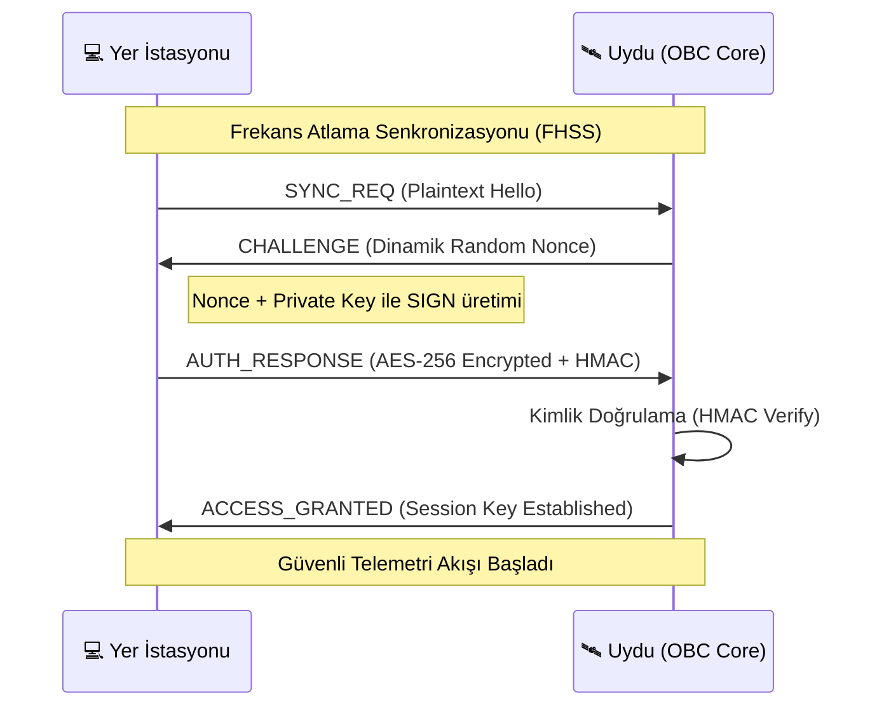

<div align="center">


# 🛰️ TEKNOFEST GÜVENLİ UYDU SİSTEMLERİ 🛡️

### **[ PROJECT: SECURE_ORBIT_V1 ]**

**Classification:** `TOP SECRET // NOFORN`
**Security Level:** `LEVEL 6 - HYBRID PQC ENCRYPTED`
**Mission Status:** `FULL SWARM OPERATIONAL`

[](https://opensource.org/licenses/MIT)
[](https://github.com/bahattinyunus)
[](https://github.com/bahattinyunus)
[](https://www.teknofest.org)
[](https://github.com/bahattinyunus)
[](https://github.com/bahattinyunus)

</div>

---

## 👨‍✈️ MISSION COMMANDER

<div align="center">
<table>
<tr>
<td align="center">

<br/>
<b>Bahattin Yunus Çetin</b><br/>
<sub>IT Architect // System Commander</sub>
</td>
<td align="left">

| **METRIC** | **DATA** |
| :--- | :--- |
| **Callsign** | `BYC_ARCHITECT` |
| **Operations** | Global / Remote Aerospace Command |
| **Specialization** | System Architecture, Cyber Security, Satellite Ops |
| **Clearance** | `LEVEL 5 / ROOT ACCESS` |

<a href="https://github.com/bahattinyunus"></a>
<a href="https://www.linkedin.com/in/bahattinyunus/"></a>

</td>
</tr>
</table>
</div>

---

## 📁 PROJECT STRUCTURE — PROJE YAPISI

```text
teknofest_guvenli_uydu/
├── src/                        # Flight Software (FSW) Katmanı
│   ├── OBC_Main.py             # Ana Otonom Sinir Sistemi
│   ├── Crypto_Engine.cpp       # AES-256 & HMAC Çekirdeği
│   └── Telemetry_Parser.py     # Veri Paketleyici/Ayrıştırıcı
├── ground_station/             # Yer İstasyonu Kontrol Arayüzü
├── tests/                      # Birim ve Entegrasyon Testleri
├── mission_control.py          # Sistem Orkestratörü & Simülasyon
├── banner.png                  # Proje Görsel Kimliği
└── requirements_secure.txt     # Bağımlılık Yazılım Katmanı
```

---

## 🔐 SECURE HANDSHAKE — GÜVENLİ EL SIKIŞMA (Handshake-X)

Uydu ve Yer İstasyonu arasındaki ilk temas, aşağıdaki **Handshake-X** protokolü ile gerçekleşir. Bu süreç, yetkisiz erişimi fiziksel katmanda engeller.



---

## 🛠️ HARDWARE TOPOLOGY — DONANIM TOPOLOJİSİ

Uydudaki komponentlerin birbirleriyle olan merkezi veri bağlantıları:

| Birim A | Birim B | Protokol | Hız / Parametre |
| :--- | :--- | :---: | :--- |
| **STM32 (OBC)** | **LoRa SX1278** | SPI | 10 MHz, Full-Duplex |
| **STM32 (OBC)** | **GPS NEO-M8N** | UART | 9600-115200 Baud |
| **STM32 (OBC)** | **MPU-6050** | I2C | 400 kHz (Fast Mode) |
| **STM32 (OBC)** | **SD Card** | SPI | Telemetri Kara Kutusu |
| **OBC** | **Payload Cam** | UART/CSI | Görüntü İşleme Verisi |

---

## � LIVE UPLINK SIMULATION — TELEMETRİ AKIŞI

Aşağıdaki blok, uydudan yer istasyonuna akan şifreli ve ayrıştırılmış telemetri verisinin bir simülasyonudur:

```bash
[UPLINK] 🛰️ SESSION: ACTIVE-SECURE-V1
[09:41:02] >> RX_ENC: 0x8F3C...A4B2 | HMAC: VALID
[09:41:03] >> DECRYPTED: {alt: 752.4m, vel: 12.5m/s, bat: 7.8V, tilt: 2.1°}
[09:41:04] >> STATUS: NOMINAL | FREQ: HOPPING_ACTIVE
[09:41:05] >> POSITION: 41.0082° N, 39.7235° E | FIX: 3D_SATELLITE
```

---

## 📊 COMPARATIVE ANALYSIS — RAKİP ANALİZİ

| Yarışma | Güvenlik Seviyesi | Otonom Karar | İletişim | Avantajımız |
| :--- | :---: | :---: | :--- | :--- |
| **NASA CanSat** | Dünyaya Açık | ✅ Kısmi | XBee | 🔒 AES-256 |
| **ESA CanSat** | Şifresiz | ❌ Kısıtlı | RF 433 | 📡 FHSS Jam-Proof |
| **ARLISS** | Şifresiz | ✅ Tam | Satellite | 🛡️ Kill-Switch |
| **🇹🇷 Güvenli Uydu** | **QUANTUM PREP** | **FULL OBC** | **LoRa SEC** | **Yerli Siber Kalkan** |

---

## � ROADMAP — YOL HARİTASI 2026

- [ ] **v1.3.0:** Swarm Intelligence — Çoklu uydu koordinasyonu.
- [ ] **v1.4.0:** Post-Quantum Crypto — Kyber/Dilithium entegrasyonu.
- [ ] **v1.5.0:** AI-Sentinel — Anomali tespiti yapan yapay zeka katmanı.

---

<div align="center">

**"GÖKLERDE İSTİKBAL, KODLARDA GÜVENLİK"**

Designed & Engineered by **Bahattin Yunus Çetin**
*Global / Remote Aerospace Command*

</div>
