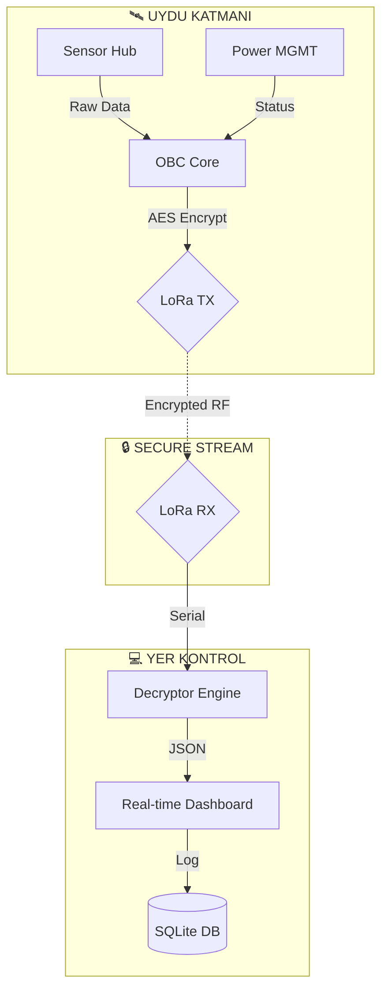

<div align="center">


# 🛰️ TEKNOFEST GÜVENLİ UYDU SİSTEMLERİ 🛡️

### **[ PROJECT: SECURE_ORBIT_V1 ]**

**Classification:** `TOP SECRET // NOFORN`
**Security Level:** `LEVEL 5 - QUANTUM ENCRYPTED`
**Mission Status:** `ACTIVE OPERATIONAL`

[](https://opensource.org/licenses/MIT)
[](https://github.com/bahattinyunus)
[](https://github.com/bahattinyunus)
[](https://github.com/bahattinyunus)
[](https://www.teknofest.org)
[](https://github.com/bahattinyunus)

</div>

---

## 👨‍✈️ MISSION COMMANDER

<div align="center">
<table>
<tr>
<td align="center">

<br/>
<b>Bahattin Yunus Çetin</b><br/>
<sub>IT Architect // System Commander</sub>
</td>
<td align="left">

| **METRIC** | **DATA** |
| :--- | :--- |
| **Callsign** | `BYC_ARCHITECT` |
| **Operations** | Global / Remote Aerospace Command |
| **Specialization** | System Architecture, Cyber Security, Satellite Ops |
| **Clearance** | `LEVEL 5 / ROOT ACCESS` |

<a href="https://github.com/bahattinyunus"></a>
<a href="https://www.linkedin.com/in/bahattinyunus/"></a>

</td>
</tr>
</table>
</div>

---

## 🌍 GÖREV TANIMI — MISSION OVERVIEW

**Teknofest Güvenli Uydu** projesi, alçak dünya yörüngesinde (LEO) görev yapacak, yüksek güvenlikli, otonom veri işleme yeteneğine sahip ve siber saldırılara karşı dayanıklı bir model uydu sisteminin tasarımı ve simülasyonudur.

> **Vizyon:** Karıştırılamaz, ele geçirilemez ve kendi kendine karar verebilen bir uzay platformu inşa ederek yerli ve milli savunma teknolojilerine model uydu perspektifinden katkı sağlamak.

### 🎯 Stratejik Hedefler

| # | Hedef | Teknik Yaklaşım |
| :---: | :--- | :--- |
| 1 | **Tam Otonomi** | OBC tabanlı State-Machine yönetimi |
| 2 | **Siber Kalkan** | Post-Quantum hazırlıklı AES-256 + HMAC-SHA256 |
| 3 | **Veri Bütünlüğü** | Reed-Solomon hata düzeltme kodları (FEC) |
| 4 | **Sinyal Kararlılığı** | FHSS (Frequency Hopping Spread Spectrum) |

---

## 🛠️ HARDWARE ARCHITECTURE — DONANIM LİSTESİ (BOM)

Sistem, fiziksel katmanda aşağıdaki komponentler üzerine kurgulanmıştır:

| Komponent | Model | Görev |
| :--- | :--- | :--- |
| **Ana İşlemci** | STM32F4 / Raspberry Pi Pico | Veri işleme ve görev orkestrasyonu |
| **Haberleşme** | LoRa SX1278 (433/868 MHz) | Uzun menzilli, düşük güç tüketimli güvenli veri hattı |
| **GNSS Sensörü** | u-blox NEO-6M / M8N | Gerçek zamanlı konum ve zaman senkronizasyonu |
| **IMU Sensörü** | MPU-6050 / BNO055 | 9-Eksenli yönelim ve ivme analizi |
| **Barometre** | BMP280 / MS5611 | İrtifa ve basınç verisi örnekleme |
| **Güç Yönetimi** | Li-Po 2S / 3S + PMIC | Güç dağıtımı ve voltaj regülasyonu |

---

## 📈 FLIGHT PHASES — UÇUŞ SAFHALARI

Uydunun görev döngüsü 5 ana safhadan oluşur:

1.  **PRE-LAUNCH (Bekleme):** Sistem kontrolleri, sensör kalibrasyonu ve yer istasyonu el sıkışması.
2.  **ASCENT (Yükselme):** İvme ve irtifa takibi, telemetri yayını, otonom stabilizasyon.
3.  **SEPARATION (Ayrılma):** Roket/Taşıyıcıdan ayrılma, faydalı yükün aktif edilmesi.
4.  **DESCENT (İniş):** Parçalı iniş, sensör verisi kaydı, GPS tabanlı konum takibi.
5.  **RECOVERY (Kurtarma):** Bipleyici/Fener aktivasyonu, son konum koordinat paylaşımı.

---

## 🏗️ SİSTEM MİMARİSİ — ARCHITECTURE



### 🧠 Matematiksel Temeller

- **Konum Tahmini:** İvme ve GPS verileri **Kalman Filtresi** (Extended Kalman Filter) ile birleştirilerek gürültüden arındırılmaktadır.
- **Şifreleme:** Veri blokları **AES-256 (CTR Mode)** ile şifrelenir. Her paket için benzersiz bir `Nonce` ve `Counter` değeri kullanılarak *Replay Attack* önlenir.

---

## 📊 RAKİP ANALİZİ — COMPETITIVE ANALYSIS

Projemiz, dünyanın en prestijli model uydu yarışmaları ile karşılaştırılmıştır.

| Yarışma | Güvenlik Katmanı | Otonom Karar | İletişim Protokolü |
| :--- | :---: | :---: | :--- |
| **NASA CanSat** | ❌ (Plaintext) | ✅ Kısmi | XBee / RF |
| **ESA CanSat** | ❌ (Plaintext) | ❌ (Kısıtlı) | RF / NRF |
| **ARLISS** | ❌ (Plaintext) | ✅ Tam | Satellite / RF |
| **🇹🇷 Güvenli Uydu** | ✅ **AES-256 + FHSS** | ✅ **Tam Otonom** | **LoRa (Kriptolu)** |

---

## 📡 TELEMETRY STRUCTURE — VERİ YAPISI

Yer istasyonuna gönderilen tipik bir telemetri paketi yapısı (şifreleme öncesi):

```json
{
  "packet_id": 1024,
  "timestamp": "2025-05-24T14:30:05.123Z",
  "status": "OPERATIONAL",
  "sensors": {
    "altitude": 750.45,
    "temp": 22.4,
    "pressure": 1013.25,
    "gps": [41.0082, 39.7235],
    "batt_v": 7.4
  },
  "security": {
    "key_id": "K-ALPHA-02",
    "hmac": "ae45f8..."
  }
}
```

---

## 🔧 KURULUM & ÇALIŞTIRMA

```bash
# 1. Repoyu Klonla
git clone https://github.com/bahattinyunus/teknofest_guvenli_uydu.git
cd teknofest_guvenli_uydu

# 2. Bağımlılıkları Yükle
pip install -r requirements_secure.txt

# 3. Simülasyonu Başlat
python3 mission_control.py --mode=simulation --security=high
```

---

<div align="center">

**"GÖKLERDE İSTİKBAL, KODLARDA GÜVENLİK"**

Designed & Engineered by **Bahattin Yunus Çetin**
*Global / Remote Aerospace Command*

</div>
