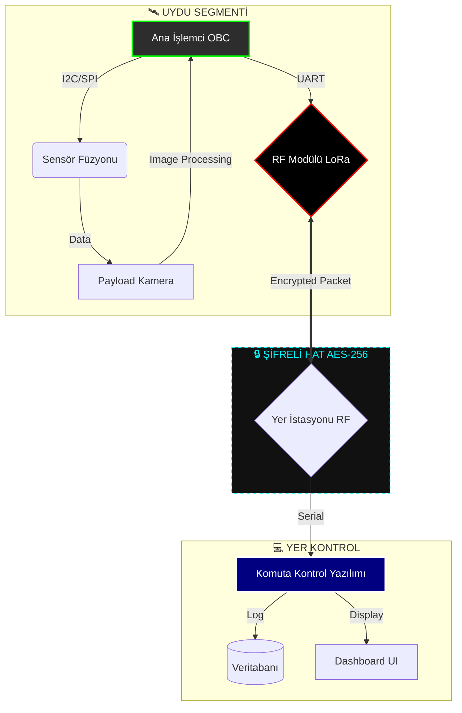

<div align="center">


# 🛰️ TEKNOFEST GÜVENLİ UYDU SİSTEMLERİ 🛡️

### **[ PROJECT: SECURE_ORBIT_V1 ]**

**Classification:** `TOP SECRET // NOFORN`
**Security Level:** `LEVEL 5 - QUANTUM ENCRYPTED`
**Mission Status:** `ACTIVE OPERATIONAL`

[](https://opensource.org/licenses/MIT)
[](https://github.com/bahattinyunus)
[](https://github.com/bahattinyunus)
[](https://github.com/bahattinyunus)
[](https://www.teknofest.org)
[](https://github.com/bahattinyunus)

</div>

---

## 👨‍✈️ MISSION COMMANDER

<div align="center">
<table>
<tr>
<td align="center">

<br/>
<b>Bahattin Yunus Çetin</b><br/>
<sub>IT Architect // System Commander</sub>
</td>
<td align="left">

| **METRIC** | **DATA** |
| :--- | :--- |
| **Callsign** | `BYC_ARCHITECT` |
| **Konum** | Trabzon / Karadeniz Sektörü |
| **Uzmanlık** | Sistem Mimarisi, Siber Güvenlik, Uydu Sistemleri |
| **Clearance** | `LEVEL 5 / ROOT ACCESS` |

<a href="https://github.com/bahattinyunus"></a>
<a href="https://www.linkedin.com/in/bahattinyunus/"></a>

</td>
</tr>
</table>
</div>

---

## 🌍 GÖREV TANIMI — MISSION OVERVIEW

**Teknofest Güvenli Uydu** projesi, alçak dünya yörüngesinde (LEO) görev yapacak, yüksek güvenlikli, otonom veri işleme yeteneğine sahip ve siber saldırılara karşı dayanıklı bir model uydu sisteminin tasarımı ve simülasyonudur.

Bu repo, uydunun **"Beyin" (Core System)** mimarisini, yer istasyonu ile olan **Kriptolu Haberleşme** protokollerini ve otonom görev icra algoritmalarını barındıran merkezi komuta veri tabanıdır.

> **Hedef:** Karıştırılamaz, ele geçirilemez ve kendi kendine karar verebilen bir uzay platformu inşa etmek.

### 🎯 Stratejik Hedefler

| # | Hedef | Açıklama |
| :---: | :--- | :--- |
| 1 | **Tam Otonomi** | Uydunun yer istasyonundan bağımsız karar verebilmesi |
| 2 | **Siber Kalkan** | Post-Quantum şifreleme algoritmalarına hazırlık |
| 3 | **Veri Bütünlüğü** | Telemetri verilerinin hatasız ve gecikmesiz transferi |
| 4 | **Anti-Jamming** | FHSS tabanlı frekans atlama ile sinyal koruması |
| 5 | **Gizlilik** | AES-256 ile uçtan uca güvenli iletişim |

---

## 🏗️ SİSTEM MİMARİSİ — SYSTEM ARCHITECTURE

Sistem, üç ana katmandan oluşan hiyerarşik bir mimariye sahiptir.



### 🧠 Çekirdek Modüller

| Modül | Dil | Açıklama |
| :--- | :--- | :--- |
| **`OBC_Main.py`** | Python | Merkezi otonom karar motoru, görev zamanlama ve güç yönetimi |
| **`Crypto_Engine.cpp`** | C++ | AES-256 şifreleme/çözme motoru, HMAC doğrulama |
| **`Telemetry_Parser.py`** | Python | Sensör verisi ayrıştırıcı, paket doğrulama katmanı |
| **`Ground_Control_UI`** | Python/Tkinter | Operatör kontrol arayüzü, gerçek zamanlı izleme |
| **`mission_control.py`** | Python | Ana simülasyon orkestratörü |

---

## 🛡️ GÜVENLİK PROTOKOLLERİ — SECURITY PROTOCOLS

Bu proje, standart bir model uydudan fazlasıdır; bir **siber güvenlik kalesidir**.

| Protokol | Açıklama | Güvenlik Seviyesi |
| :--- | :--- | :---: |
| **AES-256 Handshake** | Dinamik anahtar değişimi — her oturum için taze anahtar | ⭐⭐⭐⭐⭐ |
| **FHSS Anti-Jamming** | Frekans atlamalı yayılı spektrum ile sinyal koruması | ⭐⭐⭐⭐⭐ |
| **Black-Box Log** | Uçuş verilerinin kriptolu kara kutuya yazılması | ⭐⭐⭐⭐ |
| **HMAC Doğrulama** | Paket bütünlüğü ve kimlik doğrulama katmanı | ⭐⭐⭐⭐ |
| **Kill Switch** | Yetkisiz erişimde otomatik veri silme (Self-Destruct) | ☢️ KRİTİK |
| **Replay Attack Guard** | Tekrar oynatma saldırılarına karşı zaman damgası koruması | ⭐⭐⭐ |

---

## 📊 RAKİP ANALİZİ — COMPETITIVE ANALYSIS

Projemiz, dünyanın en prestijli model uydu yarışmaları ile teknik ve uygulama perspektifinden karşılaştırılmıştır.

| Yarışma | Organizatör | Temel Görevi | Boyut/Ağırlık | Güvenlik | Kaynaklar |
| :--- | :--- | :--- | :--- | :---: | :--- |
| **NASA/AIAA CanSat** | NASA, AIAA | Paraglider Enstrüman Teslimatı | 300–350g | ❌ | [🔗 Site](https://www.cansatcompetition.com/) |
| **ESA CanSat** | ESA (Avrupa) | Sıcaklık/Basınç Ölçümü + İkincil Görev | 66×115mm, ≤350g | ❌ | [🔗 Site](https://www.esa.int/Education/CanSat) |
| **ARLISS** | UNISEC / Stanford | Otonom Geri Dönüş (Rover/Paraglider) | 350g–1050g | ❌ | [🔗 Site](http://www.arliss.org/) |
| **UNISEC Global** | UNISEC | Uzay Mühendisliği Görevleri | Değişken | ❌ | [🔗 Site](https://www.unisec-global.org/) |
| **🇹🇷 Teknofest Güvenli Uydu** | T3 Vakfı / Türksat | **Güvenli Telemetri + Veri Şifreleme** | Şartnameye Uygun | ✅ **AES-256** | [🔗 Repo](https://github.com/bahattinyunus/teknofest_guvenli_uydu) |

### 🔑 Kritik Farklılıklar ve Rekabet Avantajı

| Özellik | Uluslararası Rakipler | Teknofest Güvenli Uydu |
| :--- | :---: | :---: |
| Uçtan Uca Şifreleme | ❌ | ✅ AES-256 |
| Anti-Jamming Koruması | ❌ | ✅ FHSS |
| Replay Attack Savunması | ❌ | ✅ Zaman Damgası |
| Otonom Karar Verme | Kısmen | ✅ Tam OBC Otonomisi |
| Kill Switch (Veri Silme) | ❌ | ✅ |
| Yerli Mühendislik | ❌ | ✅ Türk Tasarımı |

> **Sonuç:** Teknofest Güvenli Uydu, siber güvenlik katmanıyla bu kategoride **küresel bir ilk olmaya aday** projedir.

### 📎 Açık Kaynak Referanslar

| Proje | Platform | Açıklama |
| :--- | :--- | :--- |
| [maanuluque/CansatSoftware2022](https://github.com/maanuluque/CansatSoftware2022) | Python/Arduino | CanSat 2022 FSW + GCS tam örnek |
| [CanSatNeXT Library](https://github.com/netnspace/CanSatNeXT_library) | Arduino/ESP32 | ESP32 tabanlı donanım kütüphanesi |
| [AmirhoseinMasoumi/CanSat-GCS](https://github.com/AmirhoseinMasoumi/CanSat-Ground-Station) | C++/QML | Çapraz platform yer istasyonu GUI |
| [AAS/AIAA 2025-2026 Kılavuzu](https://www.cansatcompetition.com/) | PDF | Resmi teknik şartname |
| [ESA CanSat Teknik Dokümanlar](https://www.esa.int/Education/CanSat) | PDF | ESA öğrenci kaynakları |

---

## 🔧 KURULUM & ÇALIŞTIRMA

### Ön Gereksinimler

- Python 3.9+
- STM32 Toolchain
- LoRa HAT (Hardware Interface)

### Başlatma

```bash
# 1. Repoyu Klonla
git clone https://github.com/bahattinyunus/teknofest_guvenli_uydu.git
cd teknofest_guvenli_uydu

# 2. Bağımlılıkları Yükle
pip install -r requirements_secure.txt

# 3. Simülasyonu Başlat
python3 mission_control.py --mode=simulation --security=high
```

> **[SYSTEM ALERT]:** Simülasyon başladığında terminalde şifreli veri akışı göreceksiniz. Bu normaldir.

---

## 🔮 GELECEK VİZYONU — ROADMAP 2026

- [ ] **Swarm Intelligence:** Birden fazla uydunun koordineli takım görevleri
- [ ] **Post-Quantum Crypto:** Kyber-1024 / Dilithium algoritmalarına geçiş
- [ ] **AI-Powered Defense:** Anomali tespiti için YZ nöbetçi katmanı
- [ ] **Laser Link:** RF yerine optik lazer haberleşme (FSO teknolojisi)
- [ ] **Real Hardware Demo:** STM32 + LoRa fiziksel prototip uçuş testi

---

<div align="center">

**"GÖKLERDE İSTİKBAL, KODLARDA GÜVENLİK"**

Designed & Engineered by **Bahattin Yunus Çetin**
*Trabzon / Protocol 61*

</div>
